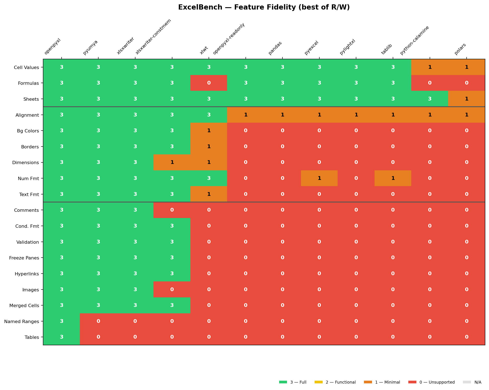

# ExcelBench

**Objective, reproducible spreadsheet-library benchmarks with a Python-first decision surface.**

Most Excel library comparisons focus on speed. ExcelBench focuses on the question developers actually have:

> Can this library handle my real spreadsheet without breaking the parts I care about?

ExcelBench models 19 XLSX features across 12+ Python adapters. In the fresh
wheel-backed WolfXL 2.0 release snapshot, 18 are scoreable across libraries
(pivot tables remain N/A on macOS fixtures).

## Results at a Glance

> Python release snapshot: 2026-04-29 UTC | wheel-backed WolfXL 2.0 rerun | [Fidelity](results-release-2026-04-28/README.md) | [Perf](results-release-2026-04-28/perf/README.md) | [Dashboard](results-release-2026-04-28/DASHBOARD.md)
>
> In that snapshot, WolfXL reaches `18/18` green features with `100%` pass rate.
>
> Cross-language context snapshot: [Apache POI `18/18`](results-cross-language/README.md) | [Excelize `18/18`](results-cross-language/README.md)
>
> Pivot capability lane: [separate artifact](results-cross-language-pivots/README.md) because the shipped macOS pivot fixture is not scoreable, while `excelize` can still emit pivot-bearing workbooks.
>
> Historical public baseline: 2026-02-17 | Excel 16.105.3 | macOS (Apple Silicon) | [Full results](results/xlsx/README.md)

> Newer performance snapshot: 2026-04-20 | [Perf results](results/perf/README.md)
>
> Read [Public Reporting Status](docs/public-reporting.md) before quoting numbers across snapshots.



**The current story:** ExcelBench now has three useful lanes. The Python release lane answers the migration question. The cross-language lane answers the ecosystem-positioning question. The pivot capability lane captures pivot evidence separately when the scored fixture is not valid on this platform. Keep every claim tied to the exact dated artifact you are citing.

## Comparison Scope

ExcelBench intentionally keeps the main public comparison **Python-first**. That is the decision surface most users care about: `openpyxl`, `xlsxwriter`, `python-calamine`, `pandas`, and adjacent Python options.

Cross-language libraries matter too, but for a different reason: they show how strong WolfXL looks next to mature spreadsheet tooling outside Python. The current checked-in cross-language lane includes:

- `Apache POI`
- `Excelize`

Pivot tables sit in a separate capability lane. On macOS, the shipped pivot fixture does not currently contain scoreable pivot OOXML, so the pivot story is tracked as a dedicated artifact instead of being mixed into the scored lane.

See [cross-language comparison strategy](docs/trackers/cross-language-comparison-strategy.md).

## Three Lanes

1. **Python replacement lane**
Use this when the question is: what should a Python team use instead of `openpyxl`?

2. **Cross-language context lane**
Use this when the question is: how does WolfXL compare to serious spreadsheet tooling in Java and Go?

3. **Pivot capability lane**
Use this when the question is: can the cross-language helpers detect or emit pivot-bearing workbooks even when the main scored fixture is not valid on macOS?

### Library Comparison

| Library | Caps | Fidelity | Read Speed | Write Speed | Modify |
|---------|:----:|:--------:|:----------:|:-----------:|:------:|
| **wolfxl** | R+W | 18/18 in 2026-04-29 release snapshot | workload-specific | workload-specific | Patch |
| openpyxl | R+W | 18/18 in 2026-04-29 release snapshot | 1x (baseline per workload) | 1x (baseline per workload) | Rewrite |
| xlsxwriter | W | 15/18 in 2026-04-29 release snapshot | -- | ~1x | No |
| xlsxwriter-constmem | W | 12/18 in 2026-04-29 release snapshot | -- | ~2x | No |
| python-calamine | R | 1/18 in 2026-04-29 release snapshot | ~1.3x | -- | No |
| pandas | R+W | 3/18 in 2026-04-29 release snapshot | <1x | <1x | Rebuild |
| polars | R | 0/18 in 2026-04-29 release snapshot | ~1x | -- | No |

> Speed numbers are snapshot-specific. Always cite the artifact date, workload, and profile. See [performance results](results/perf/README.md), [METHODOLOGY.md](METHODOLOGY.md), and [Public Reporting Status](docs/public-reporting.md).

### Key Findings

- **High-fidelity libraries are rare**: in the fresh wheel-backed release snapshot, only openpyxl and WolfXL reach 18/18 green features
- **Patch modify is structurally different**: WolfXL's `load_workbook(path, modify=True)` uses surgical ZIP patching rather than a full workbook rewrite
- **The abstraction tax is real**: pandas wraps openpyxl but drops from 16 to 3 green features due to DataFrame coercion (errors become NaN)
- **Speed vs fidelity tradeoff is measurable**: use the perf snapshot together with the fidelity matrix rather than quoting one without the other
- **Optimization modes have clear costs**: openpyxl-readonly loses 13 green features for streaming speed
- **Cross-language context is now strong too**: both `Apache POI` and `Excelize` land at `18/18` in the current scored write lane

See the [release snapshot dashboard](results-release-2026-04-28/DASHBOARD.md) for the fresh wheel-backed combined view, or the [historical dashboard](results/DASHBOARD.md) for the older public baseline.

### Score Legend

| Score | Meaning |
|:------|:--------|
| 🟢 3 | **Complete** -- full fidelity, indistinguishable from Excel |
| 🟡 2 | **Functional** -- works for common cases, some edge-case failures |
| 🟠 1 | **Minimal** -- basic recognition but significant limitations |
| 🔴 0 | **Unsupported** -- errors, corruption, or complete data loss |

## Libraries Tested

### XLSX Profile (12 adapters)

| Library | Version | Lang | Caps | Green Features |
|:--------|:--------|:-----|:-----|:--------------:|
| [openpyxl](https://openpyxl.readthedocs.io/) | 3.1.5 | Python | R+W | 18/18 |
| [XlsxWriter](https://xlsxwriter.readthedocs.io/) | 3.2.9 | Python | W | 15/18 |
| [xlsxwriter-constmem](https://xlsxwriter.readthedocs.io/) | 3.2.9 | Python | W | 12/18 |
| [openpyxl-readonly](https://openpyxl.readthedocs.io/) | 3.1.5 | Python | R | 3/18 |
| [pandas](https://pandas.pydata.org/) | 3.0.0 | Python | R+W | 3/18 |
| [pyexcel](https://github.com/pyexcel/pyexcel) | 0.7.4 | Python | R+W | 3/18 |
| [tablib](https://tablib.readthedocs.io/) | 3.9.0 | Python | R+W | 3/18 |
| [pylightxl](https://github.com/PydPiper/pylightxl) | 1.61 | Python | R+W | 2/18 |
| [python-calamine](https://github.com/dimastbk/python-calamine) | 0.6.1 | Rust | R | 1/18 |
| [polars](https://pola.rs/) | 1.38.1 | Rust | R | 0/18 |
| [xlwt](https://github.com/python-excel/xlwt) | 1.3.0 | Python | W | 4/18 |
| [xlrd](https://github.com/python-excel/xlrd) | 2.0.2 | Python | R | .xls only |

### XLS Profile (2 adapters)

| Library | Green Features | Notes |
|:--------|:--------------:|:------|
| xlrd | 4/4 | Full .xls read fidelity |
| python-calamine | 2/4 | Cross-format reader |

### Optional: Rust Backends (PyO3)

Five additional adapters via Rust/PyO3 extension modules:

| Library | Caps | Source | Notes |
|:--------|:-----|:-------|:------|
| [WolfXL](https://github.com/SynthGL/wolfxl) (calamine-styled) | R | PyPI | Full-fidelity Rust reader with style extraction |
| [WolfXL](https://github.com/SynthGL/wolfxl) (rust_xlsxwriter) | W | PyPI | Full-fidelity Rust writer |
| calamine (basic) | R | Local | Direct calamine bindings (data only, no styles) |
| rust_xlsxwriter (direct) | W | Local | Direct rust_xlsxwriter bindings |
| umya-spreadsheet | R+W | Local | Rust read + write |

```bash
# WolfXL adapters (from PyPI — no Rust toolchain needed)
uv sync --extra rust

# Local-only adapters (requires Rust toolchain + maturin)
uv run maturin develop --manifest-path rust/excelbench_rust/Cargo.toml \
  --features calamine,rust_xlsxwriter,umya
```

> `uv sync` may uninstall locally-built extensions; rerun `maturin develop` after.

### Cross-Language Context

ExcelBench now ships a separate cross-language context snapshot for mature non-Python spreadsheet libraries:

- `Apache POI` (Java)
- `Excelize` (Go)

These are not framed as Python drop-in replacements. They answer a different question: how strong is WolfXL relative to serious spreadsheet tooling outside Python?

Current checked-in cross-language snapshot:

- [`results-cross-language/README.md`](results-cross-language/README.md)
- [`results-cross-language/CONTEXT.md`](results-cross-language/CONTEXT.md)
- [`results-cross-language-pivots/README.md`](results-cross-language-pivots/README.md)
- [`docs/cross-language-context.md`](docs/cross-language-context.md)

Current takeaways from that snapshot:

- `apache-poi`: `18/18` green features in the scored write surfaces of this lane
- `excelize`: `18/18` green features in the scored write surfaces of this lane
- `pivot_tables`: tracked in a separate capability artifact because the shipped macOS fixture does not contain scoreable pivot OOXML, while `excelize` can still emit pivot-bearing workbooks

The concrete rollout plan for the first two candidates is here:

- [Apache POI + Excelize rollout plan](docs/trackers/apache-poi-excelize-rollout-plan.md)
- [Apache POI adapter design](docs/trackers/apache-poi-adapter-design.md)
- [Excelize adapter design](docs/trackers/excelize-adapter-design.md)

Run the dedicated cross-language context snapshot with:

```bash
uv run excelbench cross-language-context --tests fixtures/excel --output results-cross-language
```

Run the dedicated pivot capability artifact with:

```bash
uv run excelbench cross-language-pivot-context --fixture fixtures/excel/tier2/15_pivot_tables.xlsx --output results-cross-language-pivots
```


## Exact Evidence Manifests

A benchmark directory can be bound to its exact source and artifact identities with
a deterministic, path-free manifest:

\`\`\`bash
uv run excelbench evidence-manifest \
  --root results-release-2026-08-31 \
  --snapshot-id wolfxl-2.1-linux-x86_64 \
  --source-sha 0123456789abcdef0123456789abcdef01234567 \
  --observed-at 2026-08-31T00:00:00Z \
  --subject wolfxl-wheel@2.1.0=<wheel-sha256>

uv run excelbench verify-evidence \
  --root results-release-2026-08-31 \
  --expected-source-sha 0123456789abcdef0123456789abcdef01234567
\`\`\`

The v1 contract inventories every regular file, hashes a canonical sorted file set,
rejects symlinks and cross-platform path collisions, and refuses undeclared, missing,
or changed files. It excludes only the manifest itself. The observation timestamp is
explicit so identical inputs produce identical manifest bytes.

The manifest is the subject to sign or attest in release CI. Successful verification
does not make an evidence lane current by itself: public claims must still name the
snapshot date, source commit, tested package subjects, platform, and workload.

Schema: [\`schemas/evidence-manifest-v1.schema.json\`](schemas/evidence-manifest-v1.schema.json)


## How It Works

1. **Generate reference files** -- [xlwings](https://www.xlwings.org/) drives real Excel to produce canonical `.xlsx`/`.xls` test files with known features.
2. **Read tests** -- each library reads the Excel-generated file; extracted values are compared to the expected manifest.
3. **Write tests** -- each library writes a new file from the same spec; the output is verified by a trusted oracle (Excel via xlwings, or openpyxl in CI).
4. **Score** -- pass rates map to the 0-3 fidelity scale per feature.

Full methodology: [METHODOLOGY.md](METHODOLOGY.md)

## Public Reporting Rules

- Treat each `results/` directory as a dated snapshot.
- Do not merge February fidelity claims and April perf claims into one undated headline.
- Cite the artifact date and workload whenever quoting a speedup number.
- Keep WolfXL-specific release claims aligned with the WolfXL repo's evidence page.

See [docs/public-reporting.md](docs/public-reporting.md).

## WolfXL Docs

WolfXL documentation lives in the [wolfxl repository](https://github.com/SynthGL/wolfxl/tree/main/docs).

- [Quickstart](https://github.com/SynthGL/wolfxl/blob/main/docs/getting-started/quickstart.md)
- [Openpyxl migration guide](https://github.com/SynthGL/wolfxl/blob/main/docs/migration/openpyxl-migration.md)
- [Compatibility matrix](https://github.com/SynthGL/wolfxl/blob/main/docs/migration/compatibility-matrix.md)
- [Benchmark methodology](https://github.com/SynthGL/wolfxl/blob/main/docs/performance/methodology.md)
- [Known limitations](https://github.com/SynthGL/wolfxl/blob/main/docs/trust/limitations.md)

## Quick Start

```bash
# Install
uv sync

# Run the benchmark against pre-built fixtures (no Excel required)
uv run excelbench benchmark --tests fixtures/excel --output results

# Generate the heatmap
uv run excelbench heatmap

# Generate the combined fidelity + performance dashboard
uv run excelbench dashboard

# View results
open results/xlsx/README.md  # macOS; use xdg-open on Linux
```

To regenerate canonical fixtures from scratch (requires Excel installed):

```bash
uv run excelbench generate --output fixtures/excel
```

## Feature Coverage

### Tested (19 features; 18 currently scoreable in the release snapshot)

| Tier | Features | Count |
|:-----|:---------|:-----:|
| **Tier 0** -- Core | Cell values, formulas, multiple sheets | 3 |
| **Tier 1** -- Formatting | Text formatting, background colors, number formats, alignment, borders, dimensions | 6 |
| **Tier 2** -- Advanced | Merged cells, conditional formatting, data validation, hyperlinks, images, comments, freeze panes, pivot tables | 8 |
| **Tier 3** -- Workbook metadata | Named ranges, tables | 2 |

> Pivot tables are tested but score N/A across all adapters in the current macOS run.
> Library green-feature scores therefore use an /18 denominator in the fresh release snapshot.

### Planned

Charts, print settings, protection.

## Detailed Results

- **[XLSX results](results/xlsx/README.md)** -- per-library, per-test-case breakdowns with tier list
- **[Release snapshot results](results-release-2026-04-28/README.md)** -- fresh wheel-backed WolfXL 2.0 rerun
- **[XLS results](results/xls/README.md)** -- legacy format results
- **[Performance results](results/perf/README.md)** -- throughput benchmarks (cells/s)
- **[Release snapshot perf](results-release-2026-04-28/perf/README.md)** -- matching wheel-backed perf snapshot
- **[Dashboard](results/DASHBOARD.md)** -- combined fidelity + performance comparison
- **[Release snapshot dashboard](results-release-2026-04-28/DASHBOARD.md)** -- combined view for the fresh rerun
- **[Heatmap (PNG)](results/xlsx/heatmap.png)** | **[SVG](results/xlsx/heatmap.svg)** -- visual score matrix

## Project Status

**v0.1.0** -- actively maintained benchmarking harness with dated fidelity and performance snapshots, reproducible methodology, and multi-adapter coverage across Python and Rust-backed spreadsheet libraries.

## Contributing

See [CONTRIBUTING.md](CONTRIBUTING.md) for setup instructions, how to add features, and how to add library adapters.

## License

MIT
